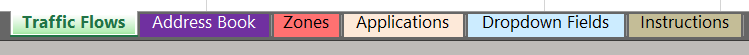
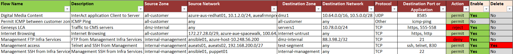
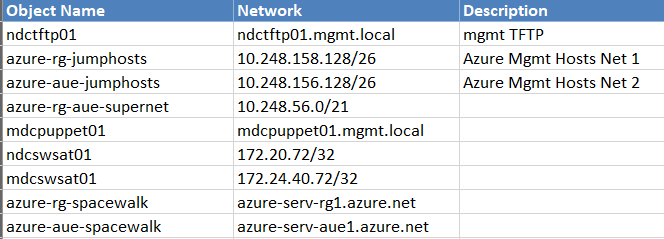
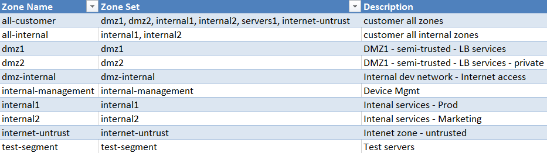
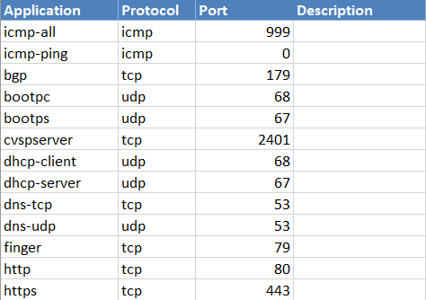

[](https://www.python.org/downloads/)
[](https://lbesson.mit-license.org/)

# Firewall Rule Manager

This tool allows to build and manage firewall security rules based on values in an Excel spreadsheet.

This allows an operator to use a familiar Microsoft Excel interface to manage firewall rules on real hardware devices without knowing device-specific CLI.
At this stage security rules are built for JunOS only, but the application and data structures allows an operator to manage the security configuration for other device types, should this be needed.
The Excel file serves as a frontend and database.

The tool itself doesn't deploy the generated configuration to firewalls, it only generates output text files.
However, it allows an operator to deploy the configuration to pre-defined test devices to check if it gives the expected outcome.

Main features:
   * Builds security rules, associated address book entries and application definitions
   * Allows to create new security rules, deactivate or delete them
   * Takes into account built-in standard firewall applications
   * Supports custom source/destination zone sets
   * Allows to use pre-defined hostnames or objects as source/destination networks
   * Supports non-TCP/UDP protocols, custom ports and applications
   * Supports validation with real devices
   * Supports filtering, sorting and reporting using standard Excel features
   
## How to:

### Add a new rule
1. Open Traffic Flows Tab
2. Enter **Flow Name**, **Description**
3. Choose **Source Zone** from a dropdown list
4. Enter **Source Network** either as network/prefix or copy-paste from Address Book Tab
5. Similarly, Choose **Destination Zone** from a dropdown list and enter **Destination Network**
6. Specify **Protocol** - TCP, UDP or other
7. For TCP and UDP enter **Port** or copy-paste from Application Tab, for other protocol, copy-paste from Application Tab 
8. Set **Enable** to Yes
9. Set Delete to No

### Deactivate existing rule
1. Open Traffic Flows Tab
2. Choose Flow by its Name
3. Switch **Enable** to **No**

### Delete existing rule
1. Open Traffic Flows Tab
2. Choose Flow by its Name
3. Switch **Delete** to **Yes**

## How it works
The tool performs the following main steps: 
1. Parse Excel spreadsheet into dataframes
2. Build objects: security rules, address books, applications, actions (Enable/Delete/Deactivate)
3. Generate config for a given network OS and save as a text file
4. Optional - connect to a test device, copy the config, provide output, and rollback to previous state
    
## User interface - Excel spreadsheet
The tool uses pre-defined Excel spreadsheet with the followings Tabs:



### Traffic flows

This is the main user interface where Traffic Flows are defined.
Based on these flows the tool builds security rules for a given OS.
In most cases, this is the only tab which requires editing.
User interface is a simple Excel spreadsheet:


It consists of the following columns:
* Flow name - identifier, should be unique
* Description - free-text description of the flow
* Source Zone/Destination Zone - choose from a dropdown list. Zones are defined in a separate Tab described below
* Source Network/Destination Network, one or more comma-separated values which can be:
   * CIDR-formatted networks, such as 10.2.2.0/24
   * Hostnames defined in Address Book tab
    
   or
   * Any

* Protocol
   * TCP or UDP - define Destination Port in the next column
   * Other - choose application defined in Applications Tab
* Action - choose from a list, can be one of the following:
   * permit
   * deny
   * reject
   
These actions are defined in a Dropdown Fields Tab

Finally, two columns which define the state of the security rule in the form of Yes/No
* Enable
   * If _Yes_ the configuration of the rule will be generated and active - Default setting. 
   * If _No_ the configuration to deactivate the rule will be generated. This is useful for existing rules.   
* Delete
   * _No_ is a default setting, nothing happens.
   * _Yes_ the configuration to delete the rule will be generated. This is useful for existing rules.
     Note that Enable is ignored and the rule will be deleted from a device.
To recreate the rule, Change _Delete_ to _No_ and _Enable_ to _Yes_

This is the only Tab to be populated, all other Tabs below are optional.

### Address Book

This Tab consists of pre-defined Objects which cab be used as Source/Destination in Traffic Flows
These objects will be built as a part of device configuration



It consists of the following columns:
* Object Name - unique ID
* Network - can in be CIDR format, such as 10.2.2.0/24, or DNS host name
* Description - free-text description

### Zones

Pre-defined zones or zone sets
Note that the configuration for the zones are not generated and it's assumed zones exist on the target device
Zone Name from this Tab is used in Traffic Flow as Source/Destination zone.
Normally this Tab is read-only.



### Applications
Pre-defined list of standard applications which can be used in Traffic Flow instead or port number, such as _https_
If Protocol is not TCP or UDP, Port can have any value



### Drop-down Fields
Read-only Tab, not for user input, but can be customised to add more Protocols or Actions if necessary

## CLI options
The tool doesn't require any CLI arguments and will use the default values.
However, it support the following options: 

> *--source_filename* - source Excel file to parse. If no file is given, uses *fw_rules_test.xls* file
>
> *--network-os* - device or OS type to generate the configuration. At the moment only *JunOS* is supported
>
> *--validate*   - Validates with the live device. The device is defined in *constdefs.py* file
>
> --screen-output - Prints report to screen. Text file is always generated. Turned on by default.
>

## Installation

It is recommended to build a Python 3 virtual environment. 
Details on how to set one up can be found [here](https://docs.python.org/3/library/venv.html). 

If you use a Windows PC, follow these steps:
1. Download and install [python 3](https://www.python.org/downloads/)
2. Setup virtual environment 
3. Activate it
4. Download source code
5. Install requirements

Windows:
```
python -m venv <path>
<path>\Scripts\activate.bat
git clone https://github.com/supro200/fw-rule-manager.git
cd fw-rule-manager
pip install -r requirements.txt
python fw_build.py
```
Linux:
```
sudo apt-get update
sudo apt install python3 python3-pip python3-venv
git clone https://github.com/supro200/fw-rule-manager.git
cd fw-rule-manager/
python3 -m venv .
source bin/activate
pip3 install -r requirements.txt
python3 fw_build.py
```


This work is in progress

Any feedback, contributions, and requests are welcome.